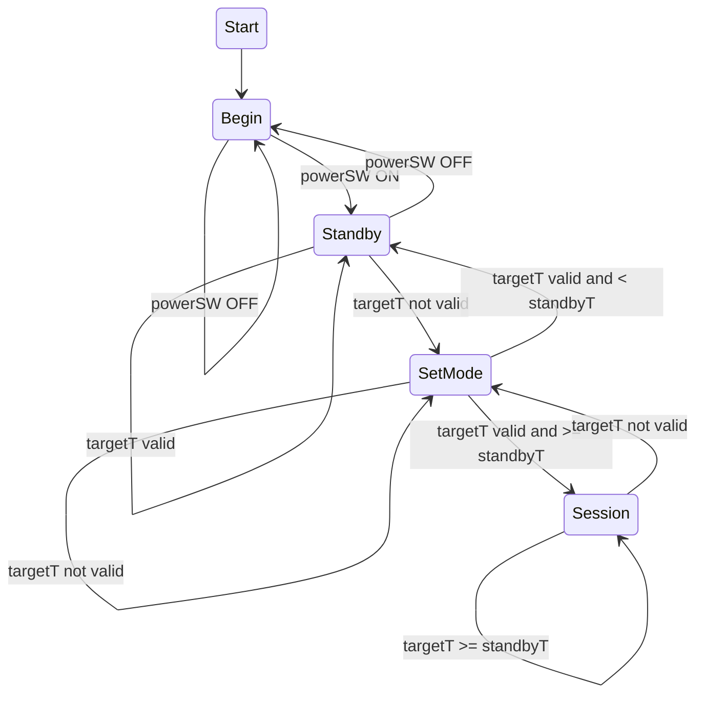
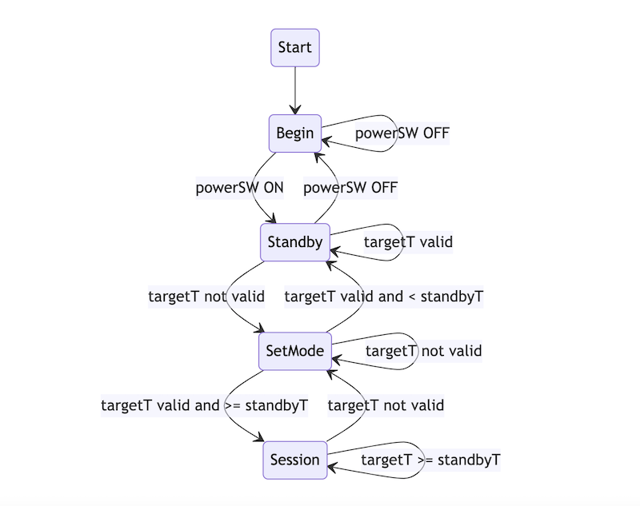

# ino-SmokerCntlr
Software for an Arduino-based replacement of a Masterbuilt Model 20070512 control unit.
This is a hack of a smoker on its way to the trash heap. Replaceable control units 
were at one time available. But no more. Details of the hack are posted 
[here](https://codingstick.com/projects/proj-sch/) 

The Arduino sketch `smokerCntlr1` is the first crack at replacing the OEM controller board
for the Masterbuilt	Electric Smoker Model 20070512.

This program implements a finite state machine (FSM). It creates a user interface
consisting of a 16x2 LCD or OLED module, and a switchable potentiometer (5 pin).
The pot switch is used to turn the interface on or off. When on, the only user
action is to set the temperature via the pot dial. A small time delay is used to 
reduce jitter and to ensure the dial has stopped moving before it decides 
that the new setting is to take effect.

The FSM is defined below using Mermaid:

If Mermaid is not supported here is a screenshot:

The condition **targetT {valid | not valid}** is an indication that the temperature 
setting dial has changed within a time period. The system goes into **SetMode** state 
and remains there until the target value has stabilized, meaning the user is no longer 
turning the dial. The heater is turned off in this state. 

The **standbyT** condition is a target temperature threshold below which the system goes into 
**Standby** state and remains there while the **targetT valid** condition holds.
The heater is turned off in this state. 

In the **Session** state, the heater element will be turned on only when the measured 
oven temperature has not reached the target. The target value is actually a band of 
values to deal with system hysteresis. For details see the link above. In all other 
states the heater will be turned off.

Note: There is a distinction between powering up the smoker system, by means of 
plugging the power cord to the mains, and powering on the display and controls, 
by means of the potentiometer switch. The former is beyond the scope of software,
obviously and is a precondition for the software to run. The latter is a user 
interface event under control of this software.

Note: This does not manage the smoker's light. That is a TODO item. Some options are 
1. set the light pin HIGH in BEGIN state and leave it on or 
2. add another physical interface switching device or 
3. add a sensor to detect when light should be on.

Option 3 could be as simple as an ambient light detector to turn it on when it gets 
dark, or more complex sensing such as motion detection to use a wave of a hand to 
toggle the light state. So much TODO and so little time.
